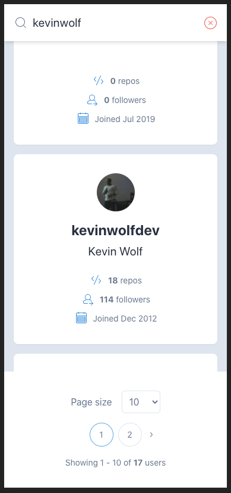
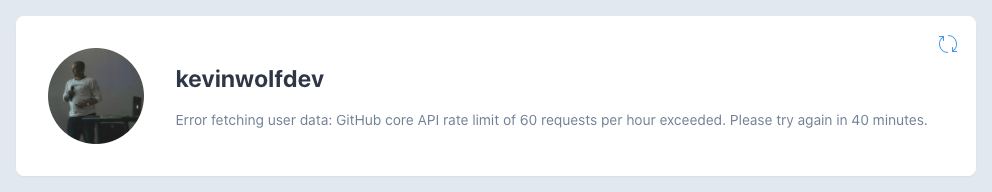
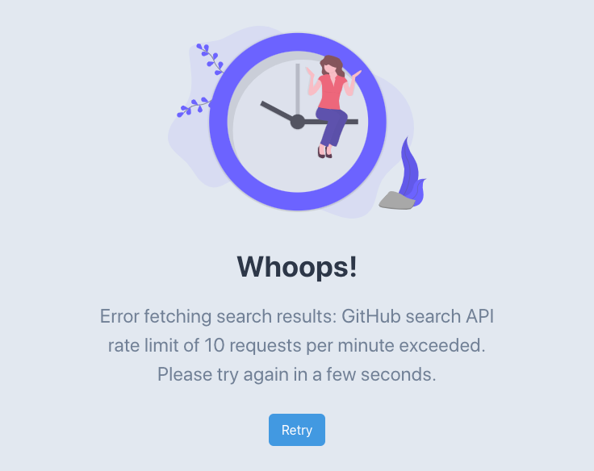
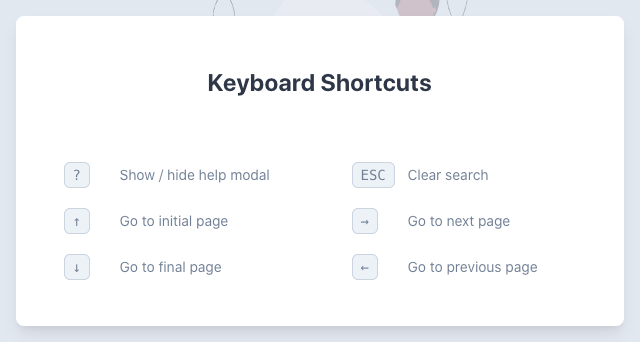

# 🔎 GitHub User Search

GitHub user search web application.

## Setup

### 1. Clone this repo

```bash
gh repo clone kevinwolfdev/github-user-search
```

### 2. Install dependencies

```bash
yarn install
```

### 3. Start the local server

```bash
yarn dev
```

### 4. Deployment

```bash
vercel
```

## Highlights

### 📱 Mobile-first.

No taking in count mobile users is a crime these days!



### 🤩 Delightful User Experience

Smooth animations powered by [Framer Motion](https://framer.com/motion) and
friendly animation provided by [Undraw](https://undraw.co).


### 🚀 Progressively enhanced.

When the GitHub Public API Rate Limit is exceeded, the UI will still be
functional and show relevant data, enabling the user to navigate through cached
data and refetch when the Rate Limit is restored.





### 💀 Loading state skeletons

Using a delayed appear animation to avoid flashing on fast connections.


### ✨ Keyboard shortcuts

For the keyboard savvy!



## Notes

1. An API call to the
   [rate_limit](https://docs.github.com/en/rest/reference/rate-limit) endpoint
   is made before each call to GitHub API to ensure we won't receive an error
   (`app -> rate_limit -> endpoint`).
2. A solution to avoid reaching API limits could have been to generate a
   personal access token and send it through the `Authorization` header,
   however, this has some caveats:
   1. The token will eventually expire, rendering the application useless.
   2. A proxy lambda function should be created to expose my access token to
      external users, this will add an extra HTTP call
      (`app -> proxy -> rate_limit -> endpoint`)
3. While this is a Single Page Application, I still choose Next.js because of
   the performance optimizations and tooling I get out-of-the-box, such as:
   1. Static generation of routes (an HTML is downloaded with styles included so
      the page is visible even when all assets have not been downloaded)
   2. Code splitting
   3. TypeScript support
   4. PostCSS support (TailwindCSS uses PostCSS and purges unused styles)
